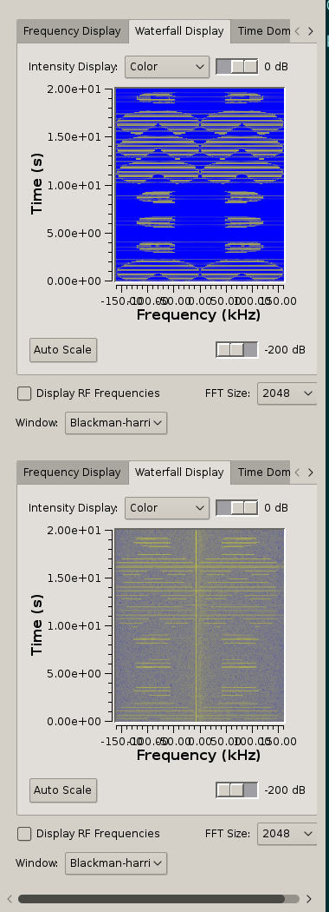

# Wireless Transmission of Digital Data using Pacman
ADC Fall 2017 Final Project
Marie-Caroline Fink, Adam Novotny, Jonah Spear


## Overview

The goal of this project was to transmit binary data using a signal that looks like a game of Pacman. We were ultimately successful in transmitting simple binary data, although our transmission times were quite slow given the constraints of our method.

## Background

The goal of this project was to encode and transmit digital data in a way that the transmission signal is human-recognizable.

We send data by using pulses that look like images when viewed on a spectrogram.

How does this work? A spectrogram is a graph which displays frequencies of a signal on the y axis and transmission time along the x axis. By varying the signal precisely, one can draw images in this way. This has been used to embed images in songs, as shown below (Aphex Twin's Equation).


We focused on transmitting binary data using something more innocuous, namely symbols from the game Pacman.

## Methods

Our encoding scheme turns a sequence of bits into a sequence of pulses, which can then be turned back into bits after transmission using a cross correlation function.

### Transmission

Our goal is to transmit images, particularly those that look like pacman and ghosts on a spectrogram. A spectrogram is a graph that shows frequency on the y axis against time on the x axis. Amplitudes of different frequencies are shown using colors. Below are two signals plotted alongside their spectrogram; the first is a pure cosine and the second is a cosine with slowly varying frequency and noise added.


Our signal generation method is as follows:
1. Take the IFFT of 4 different images to generate 4 pulses (this only needs to be done once).
2. Turn our data into 2-bit chunks.
3. Map each chunk onto a different type of pulse and concatenate pulses together.
4. Transmit pulses using a USRP.

#### Reverse Spectrogram

The most complicated step of this pipeline is step #1, constructing pulses that will look like images when viewed on a spectrogram. Our method for this is as follows:
1. Duplicate image on x axis. This it because the IFFT expects the negative frequencies in the first half of the array, and positive frequencies in the second half of the array. We want our signal to be real, so the graph should be symmetrical.
2. Slice up image horizontally and take the Inverse Fourier Transform of each slice.
3. Append the slices together and normalize.

Below is our sample image, mirrored along the x axis (so that the transmitted signal will be real).


3 slices are plotted here for clarity, although in reality many more are used to get a higher resolution. The same slices above from above image are plotted in the upper figure below. Since the image is of uniform color, the slices show up as modulated low pass filters. For each slice we then take the IFFT. The shape of the IFFTs are sinc functions modulated with a cosine.   


Again, the sincs in the above picture are superimposed only for clarity. In reality, we append each sinc one after another to get our time-domain signal. This signal has been carefully constructed to look like our sample image when viewed on a spectrogram. Each straight vertical line in the image below is the peak of a sinc.


Finally, when viewed on a spectrogram with box width equal to the length of each slice, we get the following image:



> Transmit on top, received signal on bottom. Data looks good!

One disadvantage of the sinc train above is that it can show up striped on a spectrogram. If the phase is off or the spectrogram is using a different window size, entire rows will be cold. This is because the higher frequency content is 'concentrated' in relatively few samples in the center of each sinc. If a sample does not include the peak then that line on the spectrogram will not show any energy.

An alternative is to stack many cosines with a wide band of frequencies on top of each other to generate a signal that is 'hot' along the entire bandwidth. Each cosine would be scaled by the value of the slice of the image. Then the pulses could be appended together and smoothed with a raised cosine filter.


### Decoding
To decode the signal we are receiving, it is convolved with our different pulses so as to identify where and when each symbol is showing up. This convolve will result in a high amplitude when the symbol is found and lower when it is not. This can be seen here:


In the above image the blue spikes are pacman and the green and blue spikes are ghosts. An envelope is created to find the location of each spike seen below for  It is then found whether or not the green and blue overlap, if it does its a ghost, if not its a pacman. Timing is found by transmitting the first four as ghosts to identify the interval inbetween spikes and then use that to find the other spikes. 


## Huffman Coding
We implemented [Huffman coding](https://en.wikipedia.org/wiki/Huffman_coding) to compress text messages. Huffman encoding creates an optimal coding scheme, by analyzing the order of occurrence of symbols. We built our tree with text from [hipster ipsum](https://hipsum.co/), to get a similar symbol frequency to what we (being millenials) want to send.

This compression compensates slightly for our slow symbol rate.

### Implementation details
Huffman coding creates a binary tree from bottom-up to be provably optimal.

First we define a simple binary tree class, which holds a parent, left and right nodes, and (optionally) data.

To generate a Huffman tree, first calculate the probability distribution of our symbols using the Counter library.
Next, create a leaf for each symbol. The parameters of each leaf are as follows:
```
weight = probability of the symbol
data   = symbol
```

Next, sort the list by weight. Pop the two lowest weighted nodes and create a new parent node for them. The new node has the following properties:
```
right & left = the two lowest weight nodes
weight       = sum of the two children
```
Insert this new node into a second list.
Repeat this process of connecting the two lowest weighted nodes (looking at the ends of both lists) with a new node, until one node remains. This is the root of the Huffman tree.
>Note: our implementation does not use two buffers. It has to resort the buffer every time. This is not optimal, but the speed loss in unnoticeable on a modern PC.

To make encoding easier, we generate a dictionary of symbols to code with a depth first search of the tree, given only the root. Moving to the left node adds a `1` to the code and moving to the right adds a `0` to the code. To encode a message, we iterate through the characters in the message and append the code for each symbol to a bitstream.

To decode a bitstream, we traverse the tree (moving left for `1` and right for `0`) until we hit a leaf. We append that leaf's symbol to the output string, and repeat the process (starting at the root) until we run out of bits.

### Packetization

To improve reliability, we [packetize](https://en.wikipedia.org/wiki/Network_packet) our bitstream before sending.

We chunk up the bitstream into 2 bytes per packet (16 bits). Then we append a known header [1, 0, 0].

We add a parity bit to the end for detecting errors. A [parity bit](https://en.wikipedia.org/wiki/Parity_bit) makes makes the sum of the packet even. This way, we can detect up to one bit flip. Unfortunately, we have no way to communicate back to the transmitter to ask for a retransmission, so we must accept the data loss and move on with our lives.

This makes our packets 20 bits long, which is 5 samples.

Sending one sample takes only 0.25 seconds, so our data rate is approximately 8 bps. This is about 50 times slower than hardware from the 80s. Short tweets can take 10 seconds to transmit, while sending a text message up to 160 characters takes only 2.5 minutes.
(that is when using the _fast_ pulses, more artistic pulses can have a baud rate of down to 1/2)

An advantage of the slowness is in reliability. It not only decreases error rate per bit,

## Conclusions
We have explained how our radio transmission works, and have analyzed its performance.
